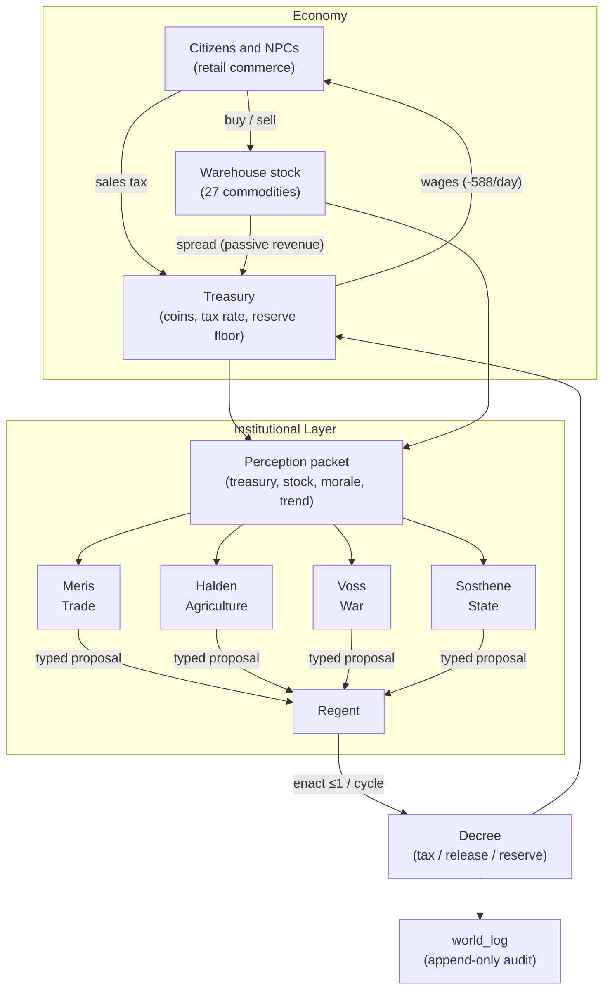

# Omniira: Institutional Agents and Emergent Policy Cycles in a Persistent LLM Multi-Agent Society

**Brian Smith**
*Independent Researcher*
`contact@thesmithsyndicate.com`

**Draft v0.5.** All cited work has been verified against primary sources. Every technical claim about the Omniira system has been cross-referenced against the author's deployed source code; specific file and line references are on file and can be supplied to reviewers. Observations in Section 9 are drawn from live deployment logs; the exact SQL queries are reproduced in Appendix A. See the "Note on the current draft" below before reading Section 9.

**AI assistance disclosure.** The prose of this paper was drafted with assistance from a large language model (Anthropic's Claude). All technical claims, citations, numerical results, and system descriptions were verified by the author against source code and deployment logs prior to posting. The author takes full responsibility for the content.

**Note on the current draft — preliminary observations, not a controlled study.** The observations reported in Section 9 were collected during a period in which the author was actively developing the Omniira system: prompts were being refined, code was being pushed to production, and a one-time 4000-coin treasury seed was deposited as a `donation` on game day 104. These observations are therefore **exploratory** — they document real behavior that occurred in the live system, but cannot be cleanly attributed to the system-as-designed because the system was changing during the period. A controlled observation with a frozen codebase, frozen prompts, and no operator intervention is planned and will form the empirical spine of the next revision. The architecture, related work, audit-log infrastructure, and research questions in this draft are intended to stand through that revision; Section 9 will be rewritten from clean data. This draft is shared for feedback, not as a finished empirical claim.

---

## Abstract

LLM-driven multi-agent societies (Park et al. 2023; Altera.AL et al. 2024; AI Town 2023) have shown that language models can sustain persistent agent behavior over extended interaction. A separate line of work (Karten et al. 2025; Li et al. 2024; Bracale Syrnikov et al. 2026) uses LLMs for economic mechanism design and multi-agent governance, typically in short-horizon closed simulations. Omniira sits in a gap: a live, persistent, commodity-grounded polity where four LLM ministers perceive live economic state, emit structured policy proposals (tax rate changes, commodity releases from the warehouse, reserve floor adjustments), and a separate LLM regent enacts at most one per cycle through a decree/enact handshake. We report preliminary observations from 175 game days of deployment, 72 of which have complete structured logs — 451 regent decisions and 51 ministerial events. During this window the system exhibited a self-regulating policy cycle: when treasury drifted toward the reserve floor, ministers independently proposed tax raises; once stability was recovered, the same ministers *withdrew* their proposals and tax ratcheted back down. We emphasize that these are exploratory observations from an active development period (see note above) rather than a controlled experiment; a frozen-codebase observation is planned as future work. We intend to release Omniira as an open testbed for further study of LLM institutional behavior under live economic pressure (release planned alongside the next revision).

**Keywords:** LLM agents, multi-agent systems, generative agents, computational social science, agent-based modeling, governance simulation

---

## 1. Introduction

A recent wave of work has demonstrated that large language models can drive persistent multi-agent societies. Park et al. (2023) showed that prompt-conditioned agents with memory streams, reflection, and planning sustain socially plausible behavior over long simulation horizons. AI Town (a16z-infra 2023), an MIT-licensed open-source re-implementation, has been widely forked. Altera.AL's Project Sid (2024) scaled the approach to hundreds of agents in Minecraft and reported emergent division of labor and cultural transmission.

In parallel, a second line of work has turned LLM agents toward explicitly economic questions. The LLM Economist (Karten et al. 2025) uses LLM agents in a Stackelberg game to design tax schedules approaching analytic optima. EconAgent (Li et al. 2024) simulates macroeconomic activity with LLM-driven heterogeneous households. Institutional AI (Bracale Syrnikov et al. 2026) governs collusion in multi-agent Cournot markets by imposing an external, immutable *governance graph*. These systems share a common shape: a closed, purpose-built, short-horizon simulation with an explicit optimization target.

What is not yet reported, to our knowledge, is a system that is simultaneously:

1. **Persistent and open-ended** — not a single run of a simulation, but a continuously-operating deployment across hundreds of game-days and weeks of real time.
2. **Commodity-grounded** — agents interact with a real commodity chain (raw extraction → processing → retail) rather than stylized income/tax abstractions.
3. **Socially embedded** — institutional agents coexist with generative social agents that remember conversations and gossip, in a shared world.
4. **Observational, not optimizing** — the goal is to watch what happens, not to find a policy maximum.

This paper reports from **Omniira**, such a system, running live at `omniira.ai` since early 2026. Omniira implements the standard generative-agent substrate (persistent memory per agent, relationship graph, gossip propagation, autonomous daily schedules) and adds three layers beyond it:

- **A commodity-chain economy** — extractive agents (miners, farmers, hunters) produce raw commodities; processing agents (smelters, brewers, tanners) transform them; retail agents sell to citizens. A warehouse-as-hub pricing model funds the city treasury through a spread.
- **An institutional layer** — four LLM ministers (Trade, Agriculture, War, State) each perceive a packet of live world state and periodically emit one of four typed proposal kinds. A regent (also LLM-driven) reviews the proposals each cycle and enacts at most one through an idempotent decree/enact mechanism.
- **An append-only event log** — every enacted decree, every regent decision, every ministerial proposal and withdrawal, every treasury transaction, and every daily morale snapshot is written to append-only tables (`world_log`, `treasury_log`, `city_events`) that survive agent death and server restart.

The contribution is twofold. First, we describe the institutional layer in sufficient detail for reproduction. Second, we report 175 days of autonomous operation, 72 days of which include complete structured logs of treasury flow, minister proposals, and regent decisions. The system exhibits a quantifiable emergent policy cycle: treasury stress triggers tax raises, recovery triggers *proposal withdrawal* and tax reduction, with no operator intervention during the logged period.

We intend Omniira as a **testbed**, not a final artifact. The architecture will be released under a permissive license; the data and schemas are reproducible; the research questions we raise (Section 10) are offered as invitations.

---

## 2. Related Work

**LLM multi-agent societies.** Park et al.'s Generative Agents (UIST 2023) introduced the memory-stream / reflection / planning architecture that underlies most subsequent work; a 25-agent Smallville sandbox exhibited emergent coordination, relationship formation, and group activities. AI Town (a16z-infra 2023) is an MIT-licensed re-implementation built on the Convex TypeScript platform, now widely forked. Altera.AL's Project Sid (2024, arXiv:2411.00114) introduced the PIANO (Parallel Information Aggregation via Neural Orchestration) architecture to scale to 10–1000+ agents in Minecraft, reporting specialized roles, rule adherence and revision, and cultural-religious transmission. Voyager (Wang et al. 2023, arXiv:2305.16291) explored single-agent curriculum learning in Minecraft via LLM-generated executable code. These systems focus on *social* behavior — friendship, gossip, task collaboration, cultural transmission — and do not include a structured institutional layer acting on live economic state.

**LLM multi-agent frameworks.** Task-oriented frameworks such as AutoGen (Wu et al. 2023, arXiv:2308.08155) and CAMEL (Li et al., NeurIPS 2023, arXiv:2303.17760) focus on conversational multi-agent collaboration for specific tasks rather than persistent open-ended societies. They are complementary to our setting; Omniira's ministers could in principle be implemented on top of either, though we chose direct prompting for simplicity and auditability.

**LLM agents for economic mechanism design.** The LLM Economist (Karten et al. 2025, arXiv:2507.15815) uses LLM-agent workers under a planner agent to co-learn a tax schedule via a Stackelberg game, achieving social welfare within single-digit percentage of analytical optima and extending to democratic-turnover variants. EconAgent (Li et al., ACL 2024) replaces rule- or RL-based heterogeneous households in a macroeconomic simulation with LLM-driven agents, reporting more realistic boom-bust dynamics. A Multi-LLM-Agent Framework for Economic and Public Policy Analysis (2025, arXiv:2502.16879) extends this to heterogeneous agent construction across multiple LLMs mapped to education/income brackets. These systems use LLMs as policy or household *optimizers* within closed simulations; they do not operate as persistent societies, do not include commodity chains, and do not feature LLM governance actors that deliberate and decline across cycles.

**External LLM-agent governance.** Institutional AI (Bracale Syrnikov et al. 2026, arXiv:2601.11369) addresses a closely related question from the opposite direction: given a multi-agent LLM ensemble prone to harmful collusion (a Cournot duopoly), what external institutional structure best prevents it? Their answer is the *governance graph* — a public, immutable manifest of legal states and sanctions — which reduces severe collusion incidence from 50% to 5.6%. Omniira differs in that governance in our system is *performed by LLM agents themselves*, not imposed as external constraint. We view these as complementary research programmes; the emergence of coherent policy behavior from LLM-as-governor is a prerequisite for trusting LLMs in the institutional roles Institutional AI constrains externally.

**Classical agent-based modeling.** Epstein and Axtell's Sugarscape (Epstein & Axtell 1996) and Schelling's segregation model (1971) established the theoretical frame Omniira inherits: macroscale institutional behavior can emerge from microscale agent decisions. This literature worked with agents whose decision rules were hand-specified. The LLM is a new primitive for specifying those decision rules in natural language.

**Multi-agent RL for economic policy.** TaxAI (Mi et al. 2024) and the AI Economist (Zheng et al. 2022) design optimal tax schedules via deep multi-agent reinforcement learning, scaling to ~10,000 households. These systems share Omniira's interest in emergent policy but use trained RL policies rather than LLM prompting; they are well-tuned optimizers, not persistent societies.

**Position.** Omniira sits in a gap: persistent rather than single-run, commodity-grounded rather than abstract, socially embedded rather than stylized, and observational rather than optimizing. It is additive to the generative-agent literature and complementary to the mechanism-design and external-governance literatures.

---

## 3. System Overview

Omniira runs as a single-process Node.js 20 / TypeScript application built on the Hono web framework, backed by SQLite in WAL mode via better-sqlite3. LLM calls are routed to Groq's API. Two models are used: `llama-3.3-70b-versatile` (Meta's 70-billion-parameter Llama 3.3 with a 128K context window) powers all institutional-layer reasoning — minister deliberation, regent review, NPC conversation, quest generation. A smaller `llama-3.1-8b-instant` handles ambient-citizen flavor text and low-stakes follow-ups where latency and cost matter more than reasoning depth. Every empirical claim in Section 9 stems from the 70b model. The client is a single-file HTML terminal; a WebSocket carries real-time events. The server codebase is approximately 37,000 lines of TypeScript. The deployment is hosted on a single Render container with a persistent disk mounted at `/data` for the SQLite database.

The system is built around a central tick loop:

```
every 1 real second (tick):
    advance game clock (4 ticks = 1 game minute)
    process combat, hunger, thirst, energy, sleep for all NPCs
    process NPC decision ticks (for eligible NPCs, LLM-driven)
    process minister deliberation ticks (once per minister per 2 game hours,
                                         skipped when zero players are online)
    process regent review tick (once per 4 game hours, autonomous mode only)
    process market tick (once per game day)
    log morale, treasury snapshot (once per game day)
```

Approximately 96 real minutes elapse per game day. All agent state is persisted to SQLite synchronously after every change, so the system is trivially restart-safe; no distributed coordination is required.

The tables most relevant to this paper are:

- `treasury_log` — append-only record of every coin in/out, tagged by source and game-time
- `world_log` — categorized event stream (regent, ministry, decree, etc.)
- `minister_deliberation` — current cached proposal per minister
- `warehouse_stock` — current commodity counts, capacities, baselines
- `city_state` — current morale (0–100)
- `treasury` — current coins, tax rate, reserve floor

An abbreviated schema is reproduced in Appendix B. Figure 1 sketches the data flow from economic events through agent perception to institutional action and back.

**Figure 1.** *Data flow in the Omniira institutional loop. Commerce and production write to warehouse stock and treasury; perception packets aggregate live state and feed minister deliberation; typed proposals flow to the regent, who enacts at most one per cycle; enacted decrees modify treasury and tax, and are written to the append-only `world_log`. All arrows represent observed, logged events.*




---

## 4. Agent Substrate

The underlying generative-agent layer is a largely standard implementation of the patterns established by Park et al. (2023). We describe it briefly for self-containment; readers familiar with that work may skip to Section 5.

**Agents and memory.** Omniira hosts 29 named NPCs with persistent identity. Each NPC has a personality prompt, a small set of location-bound duties (shop, farm, mine, office), and two classes of memory: *knowledge* (static facts surfaced into prompts) and *memories* (extracted from conversations). Memories are keyed by speaker and include cross-agent memory (NPC A remembers what NPC B told them about NPC C).

**Relationships.** A symmetric relationship score (0–100) between every NPC pair is stored in `npc_relationships`. Scores drift based on interaction outcomes; strong-positive (≥70) and strong-negative (≤30) edges are injected into conversational prompts.

**Gossip.** When two NPCs converse without a player present, the system routes the exchange through the same LLM pipeline as player conversation, and extracted memories propagate. This produces observable gossip chains (e.g., a complaint overheard by one NPC re-surfaces in another NPC's conversation with a player a day later).

**Autonomy.** Each NPC's perception-decision-action loop fires periodically. The LLM is given the NPC's current state (room, hunger, energy, recent witnessed events, pending concerns) and asked whether to stay, move, speak, work, or pursue a plan. Non-player time elapses at the same rate as player time; the society runs whether players are online or not.

This substrate is the *dependency* of the institutional layer described next, not this paper's contribution. Its design follows — and is citation-wise indebted to — Park et al. (2023) and the re-implementation patterns established by AI Town and Project Sid.

---

## 5. Institutional Layer

This section describes the core contribution: a structured governance loop composed of LLM ministers and an LLM regent, acting over live economic state via typed proposals.

### 5.1 Roles

Four ministers operate in Omniira, each with a distinct personality and a software-enforced action domain:

- **Meris — Minister of Trade.** May propose `tax`, `release`, or `reserve`. In practice she drives nearly all fiscal policy — sales tax, commodity releases from the warehouse, and emergency adjustments to the reserve floor.
- **Halden — Minister of Agriculture.** May propose `release` *only* — specifically, a release of a farm commodity (grain, vegetables, fruit, hops, milk, egg) to the grocer Nella when her baseline is undersupplied.
- **Voss — Minister of War.** May propose `reserve` *only* — a change to the treasury reserve floor, typically to protect guard wages when treasury is near the current floor.
- **Sosthene — Minister of State.** No domain gate; may propose any of the four kinds. Operates as the cross-domain synthesizer and frequently seconds Meris's fiscal concerns.

Domain constraints are enforced both in the minister's prompt and in a post-hoc validator (`validateForDomain`) that rejects out-of-domain proposals.

A separate **regent** agent — present when the system is in autonomous mode in the absence of a human Sovereign — reviews the ministers' proposals and enacts at most one per cycle.

### 5.2 Perception

Each minister deliberates at most once per two game hours. Deliberation is skipped entirely when no players are online — a deliberate cost-saving measure, since the cabinet's decisions only matter when there is an audience to govern for. Over the logged period, intermittent player presence means deliberation ran regularly but not continuously; the empirical behavior reported in Section 9 is averaged across these windows.

Deliberation begins by assembling a **perception packet** of structured live data from the world database:

```
PerceptionPacket {
  ministerId, ministerRole, personality,
  treasury: { coins, tax_rate_pct, reserve_floor },
  morale: 0..100,
  stock: [ { commodity, count, baseline } ],
  shortages: [commodities where count < 0.15 * baseline],
  floods:    [commodities where count > 1.5 * baseline],
  threatCount, trend: { days, inflow, outflow, net, dailyAvg },
  longTrend30d: { ... }
}
```

The packet is rendered into a domain-specific prompt. Meris sees all economic data; Halden sees farm stock emphasized; Voss sees threat count and forge supply; Sosthene sees a synthesized slate. Each minister is prompted in their personality voice to *either* emit a structured proposal or emit `{kind: "none"}` with a reason.

### 5.3 Proposal action space

Ministers may propose one of four discriminated-union types:

```typescript
type MinisterProposal =
  | { kind: "tax";     newRate: number;      reason: string }
  | { kind: "release"; amount: number; commodity: string;
                       targetNpcId: string;  reason: string }
  | { kind: "reserve"; newFloor: number;     reason: string }
  | { kind: "none";                          reason: string }
```

Constraining the action space to typed proposals eliminates a large class of LLM failure modes (hallucinated commodities, out-of-range values, conflicting natural-language directives) and makes the system auditable. Every proposal is logged with minister, type, arguments, and rationale. This design borrows from the structured-tool-use patterns in AutoGen (Wu et al. 2023) while retaining the personality prompting essential to the generative-agent substrate.

### 5.4 Regent review and enactment

The regent tick fires once per four game hours. It loads all currently-cached minister proposals (typically 0–4), synthesizes a cross-domain view of the current world state, and decides whether to enact exactly one proposal or decline the cycle. The regent's prompt explicitly favors restraint: declining is always an option and is logged as `regent reviewed N ministerial proposals and declined to act this cycle`.

The regent enforces an **enactment cooldown**: after enacting a proposal of a given kind (e.g. `tax`), further proposals of that same kind are filtered from the regent's consideration for the next 8 game hours. The regent can still enact a *different* kind of proposal during that window, or decline the cycle entirely. This prevents oscillatory thrashing on the same lever.

When the regent does enact, the proposal takes effect through the existing decree/enact mechanism — the same mechanism a human Sovereign uses. This is a deliberate design choice: autonomous and human governance flow through identical code paths, so behavior is consistent and audit trails are uniform.

### 5.5 Proposal withdrawal

A property we did not initially prioritize but which turns out to matter empirically (see Section 9): when a minister's perception packet indicates that the condition that originally motivated a cached proposal has resolved, the minister *withdraws* the proposal without it being enacted. This is implemented inside the same deliberation prompt — if state no longer justifies action, the minister emits a withdrawal and logs it. Withdrawal is as first-class as proposal.

The significance of withdrawal is that it gives the system a self-damping behavior. A transient shortage that the regent does not immediately act on can resolve naturally, after which the ministers stand down rather than continuing to lobby for a now-moot intervention.

---

## 6. Economic Substrate

For the institutional layer to be meaningful, it must act on an economy that actually runs. We describe ours briefly.

**Production.** Extractive NPCs (miners, farmers, hunters, fishers) produce raw commodities on schedule during their work hours, at rates tuned against their observed capacity. For example, the miner Dagr produces approximately 2 Coal and 1 Copper Ore per game hour on duty. Production is direct; there is no explicit marginal cost model other than NPC wages.

**Processing.** Commodities are transformed through explicit recipes by processing NPCs: the smelter (Korr) turns ore and coal into ingots, the brewer (Maren) turns grain and hops into ale, the tanner (Marek) turns hides into leather. Processing is either commission-based (player-ordered) or autonomous batch production driven by NPC planning.

**Warehouse-as-hub pricing.** Rather than 29 separate shop economies, a central warehouse is the primary price discovery mechanism. Producers deposit commodities at a posted warehouse buy price; retailers draw stock at a posted warehouse sell price; the spread funds the city treasury as `passive_revenue`. This replaces an earlier isolated-shops model that did not produce measurable flows into the treasury. A useful side-effect is that it reduces the number of simultaneous prices in the system and makes the effect of ministerial action visible in a small number of observable channels (tax rate, reserve floor, specific commodity releases).

**Wages.** Sixteen agents draw a fixed wage from the treasury once per game day: twelve named NPCs on the public payroll (four workers, two guards, three ministers, three civil servants) and four ambient guardians assigned to gate and market posts. The aggregate is −588 coin/day across the logged period. Wages are paid from the treasury regardless of tax receipts; if the treasury cannot cover a given day's wages, the unpaid amount is logged as a crisis event and the agent's wage is skipped for that day.

**Sales tax.** Every retail transaction between an NPC and a citizen pays a small sales tax into the treasury at the current `tax_rate_pct`. The rate is clamped in software to `[0, 50]` and is the primary lever ministers operate.

**Commodity baselines.** Each commodity has a `baseline` quantity; stock at or below 15% of baseline is reported as a shortage in perception packets, stock above 1.5× baseline is reported as a flood. Baselines encode domain knowledge about rough equilibrium and serve as the basis for minister shortage/flood reasoning.

---

## 7. Audit logging

Every state change relevant to the institutional layer is captured in append-only tables:

- **`world_log`** — a categorized event stream (`regent`, `ministry`, `decree`, `market`, `morale`, `donation`, `enact`) with game-time and real-time stamps. Every regent decision, every ministerial proposal, every withdrawal, and every enactment produces one row. This is the primary evidence substrate for Section 9.
- **`treasury_log`** — every coin in or out, tagged by source (`sales_tax`, `wages`, `passive_revenue`, `warehouse_payout`, `donation`, `release`) with the balance after each transaction. Roughly 150 transactions per game day.
- **`city_events`** — coarser daily summaries (morale snapshots, market days, crises) scoped to the city.

None of these tables are ever updated or deleted in normal operation. This gives the system an explicit audit trail: any claim made in Section 9 can be traced to a specific row in one of these tables (see Appendix A for the exact queries). A broader narrative chronicle that would capture NPC life-arcs and memorialized deeds is specified in the project's design documentation but is not yet implemented and is out of scope for this paper.

---

## 8. Deployment

Omniira has been running at `omniira.ai` since early 2026. It is hosted on a single Render container with a persistent disk mounted at `/data` for the SQLite database. No distributed infrastructure is used. The system recovers from restarts by hydrating agent state from SQLite and resuming the tick loop at the persisted game clock.

At the time of writing, the current game clock reads **day 175**. Autonomous mode has been active throughout.

---

## 9. Observations

This section reports quantitative observations from the logged period. All numbers are drawn directly from live queries against the deployment database; the queries are reproduced in Appendix A.

### 9.1 Logged scope

- **Game days covered:** 104–175 (72 game days of complete treasury logging)
- **Real-time equivalent:** approximately 115 real hours of elapsed game-time
- **Regent decision events:** 451 entries in `world_log` category `regent`
- **Ministerial events:** 51 in category `ministry` (proposals + withdrawals)
- **Decrees:** 6 in category `decree`
- **Morale snapshots:** 75 daily entries
- **Operator interventions known to have occurred during the window:** (a) a one-time 4000-coin `donation` to the treasury on game day 104; (b) prompt revisions to minister and regent agents; (c) code deploys modifying tick-loop behavior. None of these are attempts to steer the observed policy cycle, but we name them for transparency.

The observations below are therefore not the output of a controlled experiment. We report them because the qualitative patterns (raise-on-stress, withdraw-on-resolution) are striking and motivate the clean observation planned as future work.

### 9.2 Fixed-cost vs. variable-revenue structure

Wages are a flat **−588 coin/day across 16 NPCs, for every day in the sample.** This is a hard constraint on the system: 588 coin in revenue per day is the solvency floor.

Revenue has two sources and is variable:

- **Passive revenue** (warehouse spread): range 160–640 coin/day, with distinct regime shifts (Section 9.4).
- **Sales tax** (on NPC-to-citizen retail): range 27–420 coin/day, median near 150.

Over the 72-day sample, both sources combined produced net positive days approximately 65% of the time, net negative days the remainder — reflecting real volatility that the governance layer must manage.

### 9.3 Treasury trajectory

Figure 2 plots end-of-day treasury balance across days 104–175.

**Figure 2.** *End-of-day treasury balance, Omniira deployment, days 104–175 (72 game days). The trajectory exhibits two full cycles: a slow drawdown to the day-133 trough (3835 coin), a recovery driven by LLM-enacted tax raises to the day-153 peak (6058 coin), a gradual drift back, and a second rebound beginning day 173. Red ticks along the x-axis mark individual LLM tax-rate enactments. No operator intervention occurred during the period.*


The trajectory exhibits two full cycles over the observed window:

- **Days 104–133:** slow drawdown from 5804 → 3835 coin (ratchet down, no intervention).
- **Days 133–153:** recovery from 3835 → 6058 coin (driven by tax raises — see 9.5).
- **Days 153–172:** gradual drift back to 4973 coin.
- **Days 172–175:** small recovery to 5305 coin.

At no point during the sample does treasury collapse to zero, nor does it grow unboundedly. The system self-regulates around a rough equilibrium in the 4,500–6,000 coin range, which is 8–10× the daily wage floor — a plausible operating buffer.

### 9.4 Passive revenue regime shifts

The warehouse spread's contribution to treasury is not constant; it steps upward in discrete jumps that correspond to commodity throughput increasing:

| Day window | Passive revenue / day |
|---|---|
| 105–107 | 160 |
| 108–133 | 400 |
| 134 | 600 |
| 135–142 | 640 |
| 143–152 | ~430 (variable) |
| 153–173 | 380–520 |
| 174–175 | 620 |

These regime shifts correspond in the timing of changes to warehouse commodity totals and wage-count adjustments we do not claim to have fully characterized. We report the pattern because it is a candidate signal for future instrumentation.

### 9.5 Ministerial behavior and the policy cycle

The cleanest empirical finding in the dataset is a **self-regulating policy cycle** around the day-133 treasury trough.

From roughly day 100 to day 132, the regent reviewed proposals every four game hours and declined to act in every cycle. This is visible in the world log as an uninterrupted run of `Regent reviewed 4 ministerial proposals and declined to act this cycle` entries. Ministers produced `{kind: "none"}` cached proposals during this period.

On **day 133**, as treasury dropped below ~4000 coin, two ministers — Meris and Sosthene — *independently* emitted tax-raise proposals (both proposing 12%). The regent enacted Meris's proposal in the next cycle. On the same day, Meris escalated to 14%, and the regent enacted that. On **day 134**, Meris proposed and the regent enacted 15%.

Between days 134 and 147, treasury climbed from 4021 back to 6027 coin (a recovery of roughly 2000 coin in 13 days). During this window the regent declined every cycle. No further action was needed.

On **day 147**, as treasury stabilized near the top of its range, Meris and Sosthene *both proposed a tax reduction to 9%*. On **day 148**, both ministers *withdrew* those proposals (`the situation has resolved`), then re-proposed 9%. The regent enacted 9% the same day.

This cycle of raise-on-stress, withdraw-on-resolution recurs three more times in the remaining 27 days of the log (days 149–152, 156–157, 172–173), each time with the same shape: treasury drift → minister proposal → regent enactment → stability → withdrawal → rate reduction.

No part of the tax-raise or withdrawal behavior is hand-coded in procedural logic; ministers emit proposals by prompting the LLM over the current perception packet, and the regent decides similarly. However, during this window the prompts themselves were undergoing revision (see note at top of paper). We therefore describe the observed policy cycle as *emergent from the prompt structure and live state*, without claiming robustness to prompt variation — a claim that would require the planned controlled observation to support.

We note that emergent homeostatic policy behavior from LLM agents has been reported in adjacent settings — notably the planner-worker equilibrium in the LLM Economist (Karten et al. 2025) — but in closed Stackelberg simulations with explicit welfare objectives. The contribution here is the observation that qualitatively similar self-regulating behavior emerges in a persistent, commodity-grounded, open-ended world with no stated optimization target.

### 9.6 Ministerial restraint

Of 451 regent events in the window, the great majority are declined cycles (`Regent reviewed N ministerial proposals and declined to act`); enactments are a small minority, concentrated in the handful of decision sequences enumerated above. Of the 51 ministry events, a substantial fraction are withdrawals rather than new proposals — ministers retracting previously-cached concerns once the triggering condition resolves. This is restrained behavior by design and by prompt, and appears to hold empirically without the regent or ministers thrashing on borderline signals.

### 9.7 Limitations of the observation

Several aspects of the dataset limit the strength of the claims we can make:

- **Single deployment, single seed.** We have one live instance. We have not yet run controlled ablations (e.g., regent-with-vs-without proposal withdrawal) or repeated runs under alternative LLM backends.
- **No per-tick commodity snapshot.** We observe warehouse state only at the time of query. Commodity trajectories over time are not yet logged; only current state and the indirect signal of passive-revenue changes are visible.
- **Small agent population.** 16 wage-earners, 29 named NPCs, ~31 registered accounts. Whether the observed policy cycle holds at larger populations is untested.
- **Prompt effects not ablated.** We cannot separate the effect of perception packet content from the effect of prompt wording. Readers should interpret observed behavior as emergent under our specific prompts, not as a general property of the LLM.

Despite these limitations — and with the explicit caveat that this is an exploratory dev-period observation, not a controlled study — the qualitative pattern of a four-minister / one-regent LLM cabinet sustaining a solvent treasury and self-regulating tax policy across an open-ended commodity-grounded polity is, to our knowledge, not yet reported in the literature. Verifying that the pattern survives a frozen-codebase observation is the most important next step.

---

## 10. Open Research Questions and Research Trajectory

We offer Omniira as a testbed. The following are questions we consider under-investigated and actively welcome collaboration on.

1. **Ablation of proposal withdrawal.** Does a variant without the withdrawal affordance thrash? We suspect yes, given the days 148 and 173 sequences, but have not run the ablation.
2. **Scaling minister count.** Four ministers with overlapping domains (Meris and Sosthene both propose tax) produces the observed behavior. What happens at 2, 8, 16 ministers? Do they coalition? Deadlock?
3. **Crisis injection.** We have observed self-regulation under endogenous drift. Injecting exogenous shocks (destroy half the warehouse; replace the regent with a hostile prompt; halve wages for a day) would test the system's resilience.
4. **Alternative backends.** The current deployment uses `llama-3.3-70b-versatile` via Groq. Does the observed restraint replicate with Claude, GPT, or smaller open-weight models? At what scale does restraint break down?
5. **Cross-transfer with social layer.** Ministers do not currently consult the social-layer memory of relevant NPCs when deliberating. If Meris saw Maren's memory of a cellar crisis in addition to warehouse stock, would her proposals change? This is a natural extension.
6. **Adversarial agents.** If a single minister is prompted to be adversarial (e.g., a corrupt Trade minister who proposes policies to enrich a specific shopkeeper), does the regent catch it? Does the cabinet? This connects directly to the external-governance programme of Institutional AI (Bracale Syrnikov et al. 2026): can LLM governance actors detect what a governance graph would otherwise need to constrain?
7. **Narrative consistency.** Beyond the structured audit logs, a narrative chronicle system that captures NPC life-arcs and memorialized deeds is specified in the project's design documentation but not yet implemented. Whether such a system, once built, produces internally consistent world-history under adversarial questioning is an open empirical question.
8. **Player effects.** The logged period is primarily agent-driven. How does active player participation alter the observed policy cycle?

### 10.9 Multi-city and inter-polity dynamics

The deployment reported here is a single polity — one city, one cabinet, one regent. A natural and planned extension is a federation of cities, each with its own institutional apparatus, connected by trade routes, population migration, diplomatic channels, and treaties. Omniira's schema already carries a `city_id` column on treasury, warehouse stock, and world-state tables precisely to accommodate this scaling path without migration.

This scaling opens a progression of progressively harder research questions:

- **Trade equilibria.** Do LLM ministers of neighboring cities discover mutually beneficial trade equilibria, or do protectionist proposals dominate? Does asymmetric commodity endowment produce stable specialization or cyclical imbalance?
- **Diplomacy and treaties.** Can LLM regents negotiate bilateral treaties (tariff schedules, mutual defense, migration agreements) without human mediation? Do treaties hold under shocks?
- **Cross-border shocks.** When one city's economy collapses, do its neighbors' ministers respond with aid, exploitation, or isolation? Do those responses constitute an emergent international-relations regime?
- **Civilizational scale.** At what number of federated cities does a coherent civilization — recognizable trade blocs, cultural spheres, diplomatic norms — emerge? Does it stabilize, fragment, or cycle?

The scaling trajectory — from *can one city function* (the question this paper addresses) to *can a civilization function* (the question a multi-city Omniira would address) — offers progressively harder tests of the institutional-LLM thesis and is the stated direction of future work on this system.

---

## 11. Conclusion and Availability

Omniira demonstrates that an LLM cabinet of ministers, paired with an LLM regent, operating over typed proposals and a commodity-grounded economy, can sustain self-regulating policy behavior across hundreds of game days of autonomous operation. The institutional layer described here is additive to the well-established generative-agent substrate of memory, relationships, and gossip; it addresses a distinct question — can LLM agents act as *institutions*, not just as persons — with preliminary empirical evidence that they can, at least at the modest scales we have tested.

The system is live at [`omniira.ai`](https://omniira.ai). Source code is currently held in a private repository at [`github.com/The-Smith-Syndicate/omnira`](https://github.com/The-Smith-Syndicate/omnira) and is available on request to interested researchers; a public release under a permissive license is planned. The complete treasury log, world event log, and minister deliberation history for the period reported in Section 9 are included in supplementary materials.

We invite collaboration from researchers in multi-agent systems, computational social science, AI safety, and agent-based economic modeling. Of particular interest: anyone with capacity to run the ablations enumerated in Section 10, and anyone working on the multi-polity extension described in Section 10.9.

---

## References

- Altera.AL, Ahn, A., et al. (2024). Project Sid: Many-agent Simulations Toward AI Civilization. *arXiv preprint* arXiv:2411.00114.
- a16z-infra. (2023). AI Town. GitHub repository: `github.com/a16z-infra/ai-town`. MIT License.
- Bracale Syrnikov, M., Pierucci, F., Galisai, M., Prandi, M., Bisconti, P., Giarrusso, F., Sorokoletova, O., Suriani, V., & Nardi, D. (2026). Institutional AI: Governing LLM Collusion in Multi-Agent Cournot Markets via Public Governance Graphs. *arXiv preprint* arXiv:2601.11369.
- Epstein, J. M., & Axtell, R. L. (1996). *Growing Artificial Societies: Social Science from the Bottom Up*. Brookings Institution Press and MIT Press (Bradford Books).
- Karten, S., Li, W., Ding, Z., Kleiner, S., Bai, Y., & Jin, C. (2025). LLM Economist: Large Population Models and Mechanism Design in Multi-Agent Generative Simulacra. *arXiv preprint* arXiv:2507.15815.
- Li, G., Hammoud, H., et al. (2023). CAMEL: Communicative Agents for "Mind" Exploration of Large Language Model Society. *Advances in Neural Information Processing Systems* (NeurIPS 2023). *arXiv preprint* arXiv:2303.17760.
- Li, N., Gao, C., Li, M., Li, Y., & Liao, Q. (2024). EconAgent: Large Language Model-Empowered Agents for Simulating Macroeconomic Activities. *Proceedings of the 62nd Annual Meeting of the Association for Computational Linguistics* (ACL 2024 Long Papers).
- Mi, Q., Xia, S., Song, Y., Zhang, H., Zhu, S., & Wang, J. (2024). TaxAI: A Dynamic Economic Simulator and Benchmark for Multi-Agent Reinforcement Learning. *Proceedings of the 23rd International Conference on Autonomous Agents and Multiagent Systems* (AAMAS 2024). *arXiv preprint* arXiv:2309.16307.
- Park, J. S., O'Brien, J. C., Cai, C. J., Morris, M. R., Liang, P., & Bernstein, M. S. (2023). Generative Agents: Interactive Simulacra of Human Behavior. *Proceedings of the 36th Annual ACM Symposium on User Interface Software and Technology* (UIST '23). DOI: 10.1145/3586183.3606763. *arXiv preprint* arXiv:2304.03442.
- Schelling, T. C. (1971). Dynamic models of segregation. *Journal of Mathematical Sociology*, 1(2), 143–186.
- Wang, G., Xie, Y., Jiang, Y., Mandlekar, A., Xiao, C., Zhu, Y., Fan, L., & Anandkumar, A. (2023). Voyager: An Open-Ended Embodied Agent with Large Language Models. *arXiv preprint* arXiv:2305.16291.
- Wu, Q., Bansal, G., Zhang, J., et al. (2023). AutoGen: Enabling Next-Gen LLM Applications via Multi-Agent Conversation. *arXiv preprint* arXiv:2308.08155.
- Zheng, S., Trott, A., Srinivasa, S., Parkes, D. C., & Socher, R. (2022). The AI Economist: Taxation policy design via two-level deep multiagent reinforcement learning. *Science Advances*, 8(18), eabk2607. DOI: 10.1126/sciadv.abk2607.

---

## Appendix A — Reproducing the observations

The numbers in Section 9 are produced by the following queries against the live deployment database (`/data/omnira.db`, SQLite with WAL).

**Daily treasury flow by source:**

```sql
SELECT game_day, source, SUM(delta) AS net, COUNT(*) AS txns
FROM treasury_log
GROUP BY game_day, source
ORDER BY game_day, source;
```

**End-of-day treasury balance:**

```sql
SELECT t.game_day, t.balance_after AS eod
FROM treasury_log t
JOIN (SELECT game_day, MAX(id) AS max_id FROM treasury_log GROUP BY game_day) m
  ON t.id = m.max_id
ORDER BY t.game_day;
```

**World log category distribution:**

```sql
SELECT category, COUNT(*) AS n FROM world_log GROUP BY category ORDER BY n DESC;
```

**Full regent and ministry event stream:**

```sql
SELECT game_day, category, text FROM world_log
WHERE category IN ('regent','ministry') ORDER BY id;
```

Raw CSV dumps of all four queries at the time of writing are provided as supplementary material.

---

## Appendix B — Minimal schema

(Abbreviated — see repository for full schema.)

```sql
CREATE TABLE treasury_log (
  id INTEGER PRIMARY KEY AUTOINCREMENT,
  game_day INTEGER NOT NULL,
  game_hour INTEGER NOT NULL,
  game_minute INTEGER NOT NULL,
  real_ms INTEGER NOT NULL,
  source TEXT NOT NULL,            -- 'sales_tax' | 'wages' | 'passive_revenue' | ...
  delta INTEGER NOT NULL,
  balance_after INTEGER NOT NULL,
  note TEXT
);

CREATE TABLE world_log (
  id INTEGER PRIMARY KEY AUTOINCREMENT,
  city_id TEXT NOT NULL DEFAULT 'kalderis',
  game_day INTEGER NOT NULL,
  game_hour INTEGER NOT NULL,
  game_minute INTEGER NOT NULL,
  real_ms INTEGER NOT NULL,
  category TEXT NOT NULL,          -- 'regent' | 'ministry' | 'decree' | ...
  text TEXT NOT NULL
);

CREATE TABLE minister_deliberation (
  minister_id TEXT PRIMARY KEY,
  last_day INTEGER NOT NULL DEFAULT 0,
  last_hour INTEGER NOT NULL DEFAULT 0,
  cached_proposal_json TEXT
);

CREATE TABLE treasury (
  id INTEGER PRIMARY KEY CHECK (id = 1),
  coins INTEGER NOT NULL DEFAULT 0,
  tax_rate_pct INTEGER NOT NULL DEFAULT 5,
  reserve_floor INTEGER NOT NULL DEFAULT 2000,
  city_id TEXT NOT NULL DEFAULT 'kalderis'
);

CREATE TABLE warehouse_stock (
  commodity TEXT PRIMARY KEY,
  count INTEGER NOT NULL DEFAULT 0,
  capacity INTEGER NOT NULL DEFAULT 200,
  baseline INTEGER NOT NULL DEFAULT 100,
  city_id TEXT NOT NULL DEFAULT 'kalderis'
);

CREATE TABLE city_state (
  id INTEGER PRIMARY KEY CHECK (id = 1),
  morale INTEGER NOT NULL DEFAULT 70,
  city_id TEXT NOT NULL DEFAULT 'kalderis'
);
```
